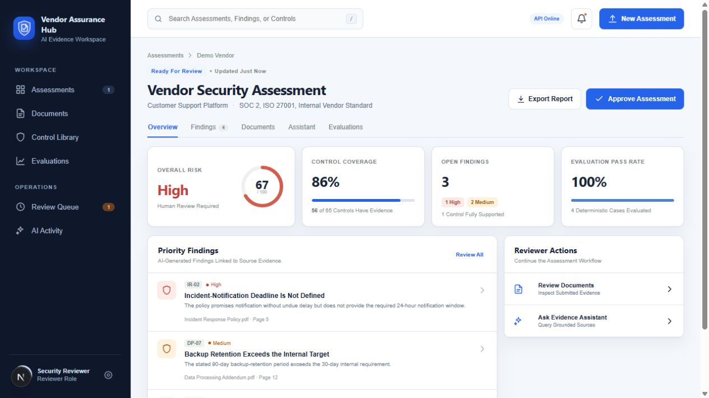
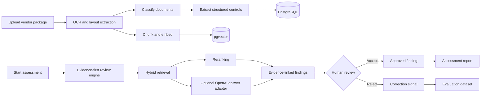

# Vendor Assurance Hub

[](https://github.com/gaboscini/ai-vendor-document-review-system/actions/workflows/validate.yml)
[](LICENSE)

A full-stack AI evidence workspace for reviewing vendor security documents, identifying control gaps, answering questions with citations, and keeping final decisions under human control.

The repository includes a working reviewer UI, a typed FastAPI service, evidence retrieval, an optional OpenAI Responses API adapter, human review actions, an executable evaluation suite, a pgvector-ready database schema, and local container orchestration. The supplied demonstration remains repeatable without external credentials; model-backed answering can be enabled through configuration.

## Application preview



The main assessment workspace brings risk posture, evidence coverage, AI-generated findings, deterministic evaluation results, and human-owned decisions into one review surface.

## Business problem

Vendor-security reviews often require analysts to reconcile questionnaires, policies, control evidence, contractual requirements, and remediation discussions across disconnected files and tools. Manual review is slow, difficult to audit, and vulnerable to unsupported conclusions when source evidence is incomplete or ambiguous.

Vendor Assurance Hub turns that process into an evidence-first workflow. It retrieves the relevant source material, links every material finding to a document location and quotation, evaluates answer quality, and keeps approval or rejection with the human reviewer.

## Product experience

The reviewer sees the complete assessment state in one workspace:

- risk score and control coverage;
- AI-generated findings ranked by severity;
- source document, page, section, and supporting quote;
- confidence and recommended remediation;
- accept or reject decisions owned by a human reviewer;
- grounded questions restricted to submitted evidence;
- extraction, retrieval, citation, latency, and cost metrics.
- persistent Light, Dark, and System themes with configurable accent and display density.

The interface is fully interactive and API-backed. Reviewers can create assessments with document uploads, search and filter records, inspect documents and controls, ask grounded questions, accept or reject findings, approve assessments, read notifications, review the AI activity ledger, and download a Markdown assessment report.

## Primary workflow



## Architecture

| Layer | Included implementation | Production extension |
| --- | --- | --- |
| Web application | Next.js, React, TypeScript, responsive reviewer workspace | SSO and role-aware navigation |
| API | FastAPI, Pydantic, assessment and decision endpoints | Tenant-aware persistence and authorization |
| AI answering | Deterministic evidence engine plus optional OpenAI Responses adapter | Provider routing, prompt registry, and fallbacks |
| Retrieval | In-memory evidence ranking used by the runnable demo | PostgreSQL full-text search, pgvector, metadata filtering, and reranking |
| Processing | Typed processing stages and container service boundaries | Redis-backed durable workers |
| Storage | MinIO service and object-storage configuration | Encrypted managed object storage and malware scanning |
| Database | PostgreSQL schema with vector, JSON, HNSW, GIN, and RLS | Applied tenant policies and migration automation |
| Evaluation | Four executable grounding, citation, retrieval, and abstention cases | Larger regression sets and reviewer-derived cases |
| Deployment | Docker Compose | Managed database, queue, storage, tracing, and autoscaling |

The deterministic mode is the default so reviewers can run the complete demonstration without sending documents to a third party. Set `DEMO_MODE=false` and provide `OPENAI_API_KEY` to exercise the included OpenAI adapter; retrieval and citations remain application-owned.

## Repository structure

```text
apps/
  api/                 FastAPI service, schemas, review engine, and tests
  web/                 Next.js reviewer interface
data/                  Evaluation cases
docs/                  Architecture, setup, testing, and demonstration guide
infra/postgres/        PostgreSQL and pgvector schema
sample-documents/      Synthetic security-review documents
docker-compose.yml     Local application stack
```

## Run the web interface

```powershell
cd apps/web
npm install
npm run dev
```

Open `http://localhost:3000`.

## Run the API

```powershell
cd apps/api
python -m venv .venv
.venv\Scripts\Activate.ps1
pip install -r requirements.txt
uvicorn app.main:app --reload
```

API documentation is available at `http://localhost:8000/docs`.

To enable model-backed answering, set these values in `apps/api/.env` or the process environment before starting the API:

```dotenv
DEMO_MODE=false
OPENAI_API_KEY=your-key
OPENAI_MODEL=gpt-5-mini
```

Do not commit the populated `.env` file.

## Run the complete stack

Copy `.env.example` to `.env`, replace the local demonstration values, and run:

```powershell
docker compose up --build
```

Services:

- Web interface: `http://localhost:3000`
- API: `http://localhost:8000`
- OpenAPI: `http://localhost:8000/docs`
- MinIO console: `http://localhost:9001`

## API examples

Get the demonstration assessment:

```http
GET /api/v1/assessments/11111111-1111-4111-8111-111111111111
```

Ask an evidence-grounded question:

```http
POST /api/v1/assessments/11111111-1111-4111-8111-111111111111/questions
Content-Type: application/json

{
  "question": "What is the incident notification deadline?"
}
```

Record a human decision:

```http
PUT /api/v1/assessments/11111111-1111-4111-8111-111111111111/findings/finding-1/decision
Content-Type: application/json

{
  "decision": "accepted",
  "note": "Confirmed during reviewer validation"
}
```

Additional workflow endpoints:

```text
POST /api/v1/assessments
POST /api/v1/assessments/{assessment_id}/documents
PUT  /api/v1/assessments/{assessment_id}/approve
GET  /api/v1/assessments/{assessment_id}/report
GET  /api/v1/review-queue
GET  /api/v1/controls
GET  /api/v1/activities
GET  /api/v1/notifications
PUT  /api/v1/notifications/{notification_id}/read
```

## Evaluation strategy

The project treats evaluation as part of the product, not a final demonstration step.

| Metric | Purpose |
| --- | --- |
| Answer fact accuracy | Checks required facts and prohibited claims |
| Retrieval recall@5 | Confirms required evidence enters the candidate set |
| Citation precision | Checks that citations support the associated claim |
| Safe abstention rate | Verifies unsupported questions do not receive invented answers |
| P95 latency | Measures the deterministic evaluation path |

The four included synthetic cases cover incident notification, backup retention, encryption, and unsupported future guarantees. Run them with `pytest tests` from `apps/api`; the `/api/v1/evaluations/summary` endpoint computes the same metrics from the checked-in dataset.

## Security model

- No credentials or real vendor documents are committed.
- Documents, chunks, findings, and AI runs have tenant-ready ownership boundaries.
- PostgreSQL row-level security is enabled on protected tables.
- Every material finding must carry source evidence.
- AI recommendations remain pending until a reviewer decides.
- Model usage, latency, prompt version, trace ID, and estimated cost are auditable.
- Production adaptations must add SSO, tenant policies, malware scanning, retention, managed secrets, and encrypted cloud storage.

See [SECURITY.md](SECURITY.md) for the disclosure and deployment boundary.

## Portfolio demonstration

Use the included synthetic documents and follow [docs/DEMO_GUIDE.md](docs/DEMO_GUIDE.md). The strongest demonstration is the incident-notification finding: the system identifies ambiguous language, links the exact policy quote, refuses to invent a 24-hour commitment, and leaves the risk decision with the reviewer.

## Author

Created and maintained by [gaboscini](https://github.com/gaboscini).

## License

MIT © 2026 gaboscini
